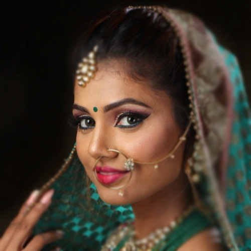
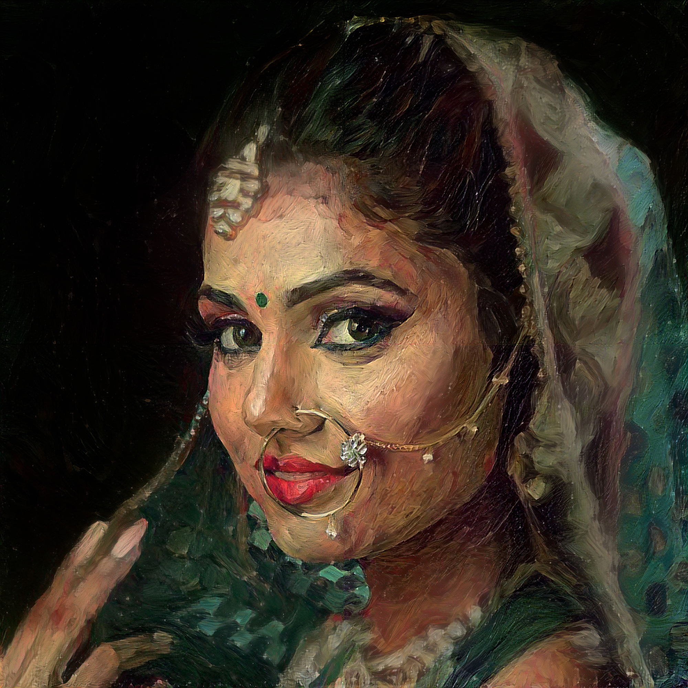
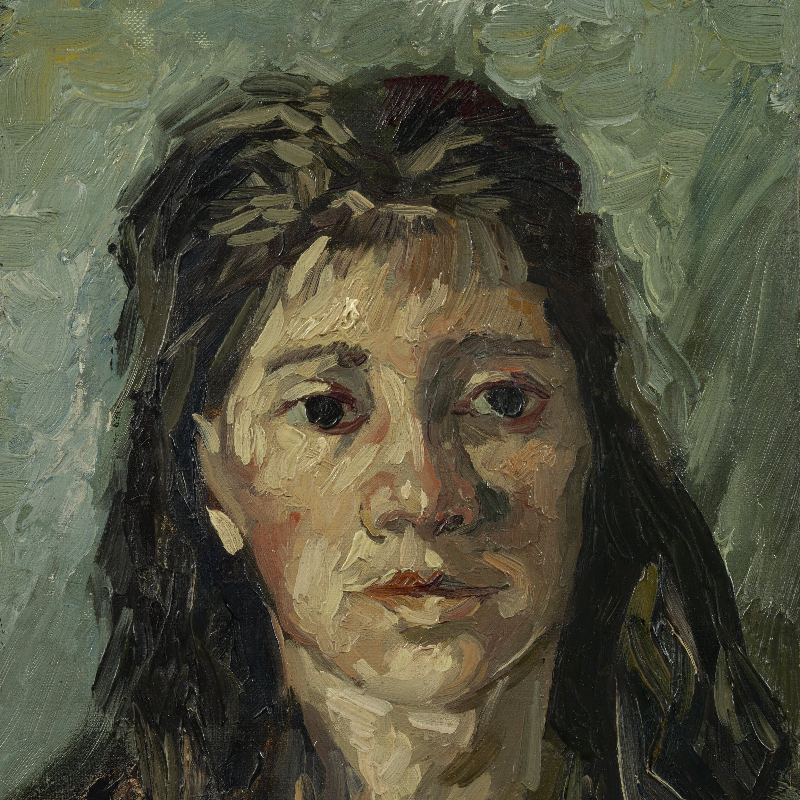
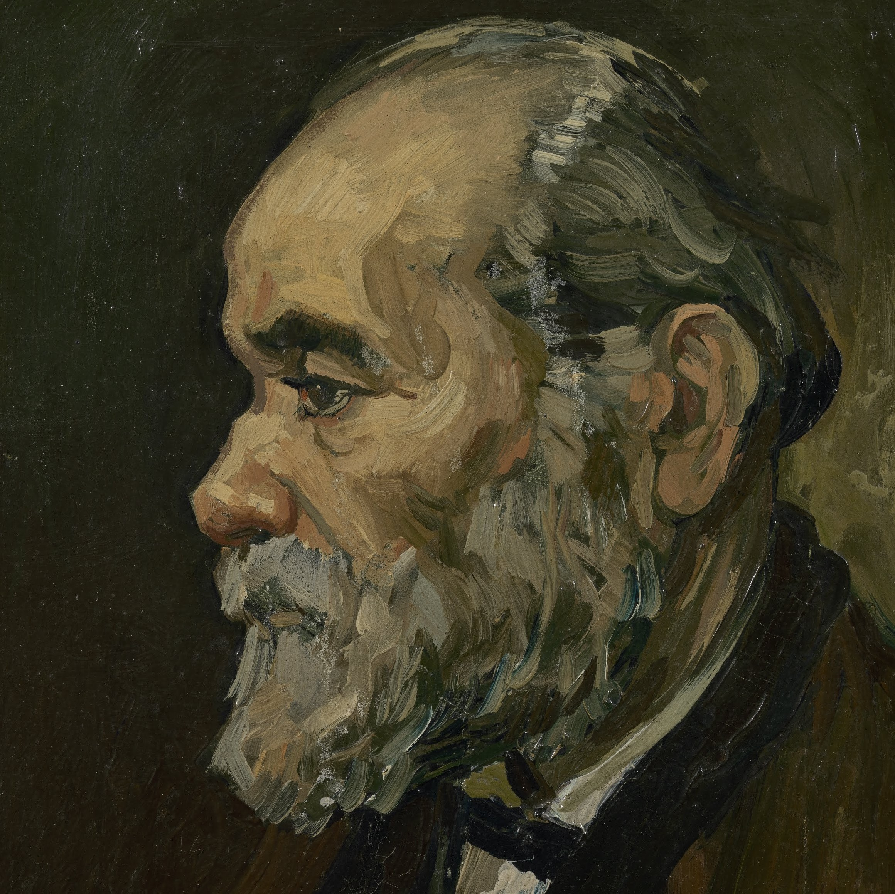

# Slow style transfer

Slow style transfer using summary statistics, as originally described by Gatys et al is still the most flexible and robust method for *multi-resolution* style transfer. However, its difficult to construct ultra high resolution styled images due to memory limitations, especially when using the LBFGS optimizer. This repo is contains code for my attempts at solving this problem by by trading high memory usage for more computation time. A lot of ideas have been borrowed from the following papers:

1. [Controlling perceptual factors in NST](http://openaccess.thecvf.com/content_cvpr_2017/papers/Gatys_Controlling_Perceptual_Factors_CVPR_2017_paper.pdf)
2. [Combining MRF and CNNs](https://arxiv.org/pdf/1601.04589.pdf)
3. [Improving NST](https://pdfs.semanticscholar.org/9d19/affb1521192b5a075f33ff517dd06a5c17dc.pdf)

Notes/Todo :
~~1. VGG weights have not been normalized to give a mean activation of 1~~

2. Correlation chain

Some results:

This image was created by stylizing a low resolution image (300x300), then using the output to initialize a higher resolution stylized image. This was repeated until gpu memory limits were reached. After that the patch based method implemented by the function `stylize_patches` was used.

(300,300) --> (600,600) --> (1000,1000) --> patch based (2000,2000)

Content:

Result:

Styles:

